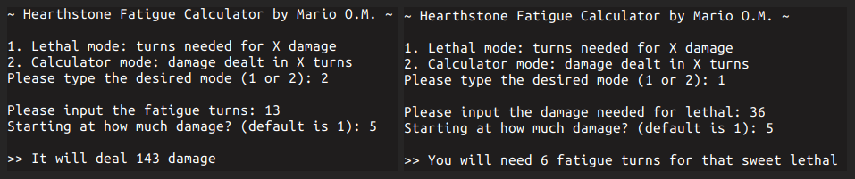
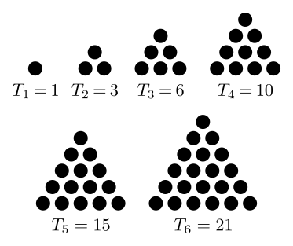
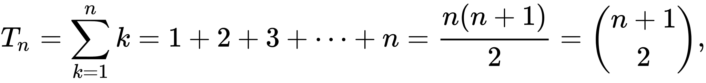
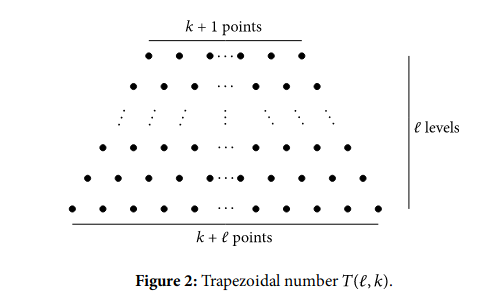
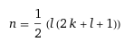
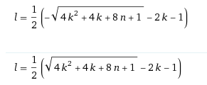

# Hearthstone Fatigue Calculator
A handy fatigue calculator, useful when you're playing Mill Rogue or similar decks and you need a quick and reliable way to calculate the lethal damage. 

## Modes
1. **Lethal mode**: turns needed for X damage
2. **Calculator mode**: damage dealt in X turns

*Note: You get to choose the initial fatigue damage in both modes*

## How to use
If you don't want to install anything you can copy-paste the code in [fatigue.py](https://raw.githubusercontent.com/marioortizmanero/hearthstone-fatigue-calculator/master/fatigue.py) to [repl.it](https://repl.it/languages/python3). Otherwise, `python3 fatigue.py` will do the trick if you have Python >= 3.6.

You can exit the program by pressing Ctrl+C

## How it works
The basics of this program are actually a very popular mathematical problem: the [triangular numbers](https://en.wikipedia.org/wiki/Triangular_number). They count objects arranged in an equilateral triangle, as in the diagram below:

The total fatigue damage is equivalent to the sum of all the points in the triangle, while the turns are the number of rows. The sum can then be expressed as a less computationally expensive formula:

But in many situations, you don't start at 1 point. Maybe you're already 3 turns in and you want to calculate the damage needed for a fatigue lethal. That's when trapezoidal numbers come into play. You can learn more about them [on this paper by Carlton Gamer, David W. Roeder and John J. Watkins](https://www.jstor.org/stable/2689901?origin=crossref&seq=1#metadata_info_tab_contents). It's basically the same as the triangular numbers but starting at `k+1` instead of 1.

 A trapezoidal triangle can be expressed as the entire triangular number (until `k+l`) minus the small triangular number (until `k`). To obtain the trapezoidal number beginning with `k+1`, the formula then can be simplified to:
 
 
 
Now, to find the turns needed for lethal given the total fatigue damage, the solved formula for `l` (starting at `k` instead of `k+1`) can be used:

 

 
## Sources:

* [Triangular Numbers](https://en.wikipedia.org/wiki/Triangular_number)
* [C. Gamer, D. W. Roeder, and J. J. Watkins, “Trapezoidal Numbers,” Mathematics Magazine, vol. 58, no. 2, pp. 108–110, 1985](https://www.hindawi.com/journals/ijmms/2017/4515249/)
* [R. Guy, “Sums of consecutive integers,” The Fibonacci Quarterly. Official Organ of the Fibonacci Association, vol. 20, no. 1, pp. 36–38, 1982](http://citeseerx.ist.psu.edu/viewdoc/download?doi=10.1.1.388.5889&rep=rep1&type=pdf)
